# 💥 UltraMPV v2.0.0 💥

<br />

## The BEST realistic 4K video playback experience in the world!

<div style="display: flex; align-items: center; justify-content: center;">
  
</div>

<br />

## 🏗️ INSTALLATION GUIDE
###### Carefully follow all steps in this guide to completely transform your MPV Player so it can rival the highest quality video players in existence. (Optimized for Nvidia)

<br />

<div style="display: flex; align-items: center; justify-content: center;">
  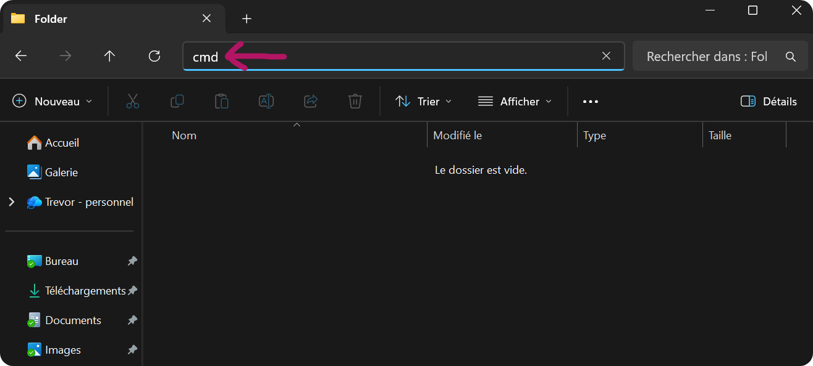
  <span>➡️</span>
  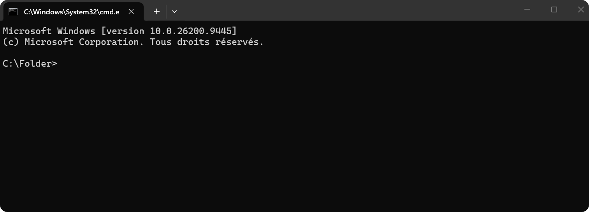
</div>

### 1. Browse to the location on your PC where you would like the 100% self-contained fully portable UltraMPV installation to live. Open a Command Prompt inside that folder by clicking in the **Address Bar** at the top, typing `cmd`, and pressing Enter. This will open a Command Prompt terminal directly inside your desired installation folder.

<br />

<div style="display: flex; align-items: center; justify-content: center;">
  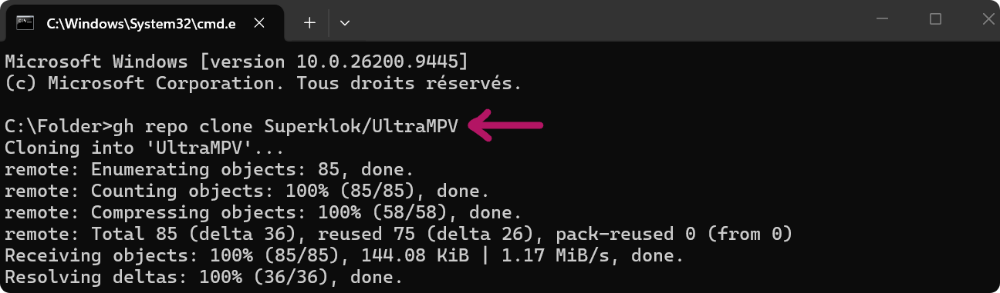
  <span>➡️</span>
  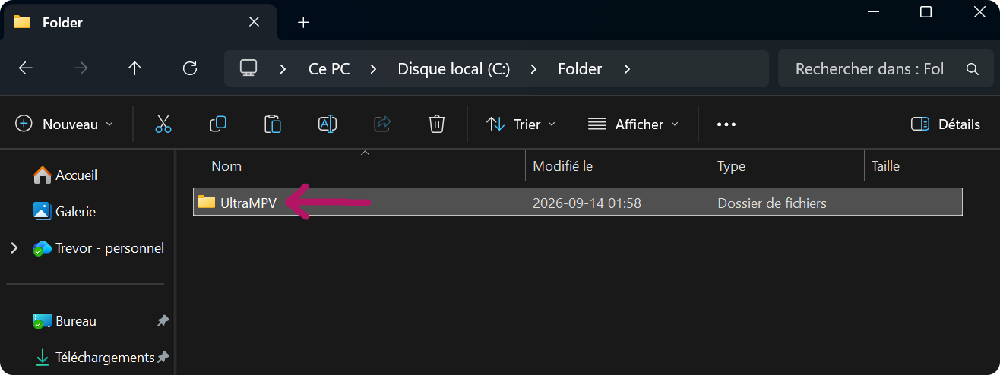
</div>

### 2. Download UltraMPV from the [OFFICIAL GitHub repository](https://github.com/Superklok/UltraMPV) by entering the following code into the Command Prompt terminal to download the latest version of UltraMPV:

```shell
gh repo clone Superklok/UltraMPV
```

<br />

<div style="display: flex; align-items: center; justify-content: center;">
  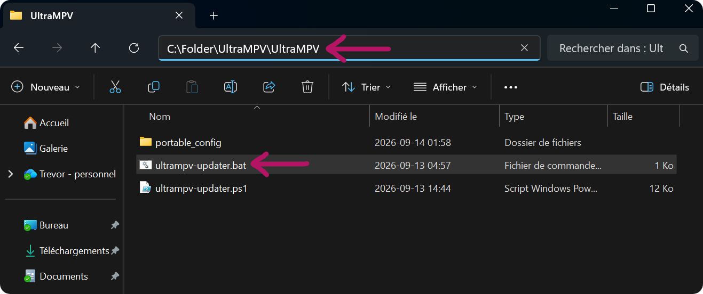
  <span>➡️</span>
  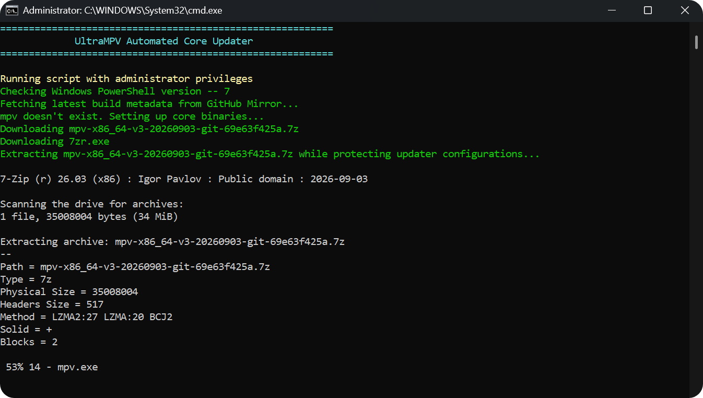
</div>

### 3. Once the GitHub command is finished running, an `UltraMPV\` folder will appear in your installation directory. Open the `UltraMPV\UltraMPV` folder, right-click the fully automated `ultrampv-updater.bat` file, and run as administrator to run the UltraMPV installer/updater.

<br />

<div style="display: flex; align-items: center; justify-content: center;">
  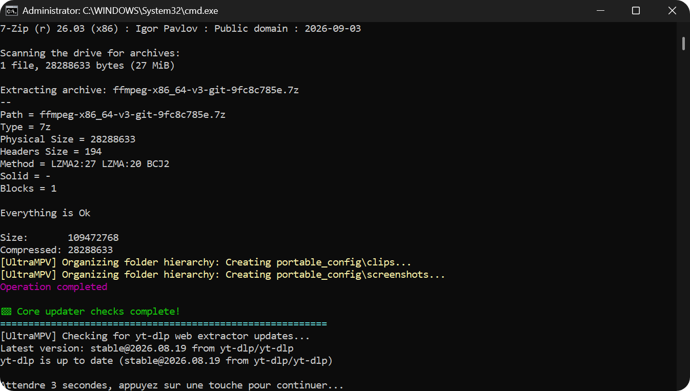
  <span>➡️</span>
  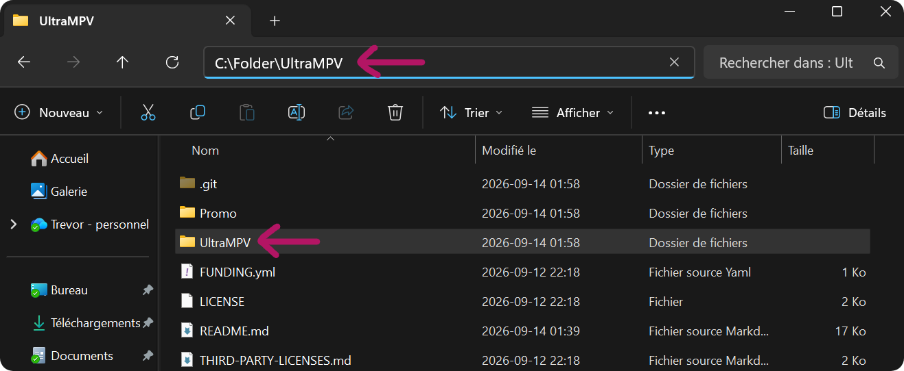
</div>

### 4. The terminal will automatically run through all the necessary UltraMPV installation steps, then it will close on its own once everything is correctly installed/updated.

<br />

<div style="display: flex; align-items: center; justify-content: center;">
  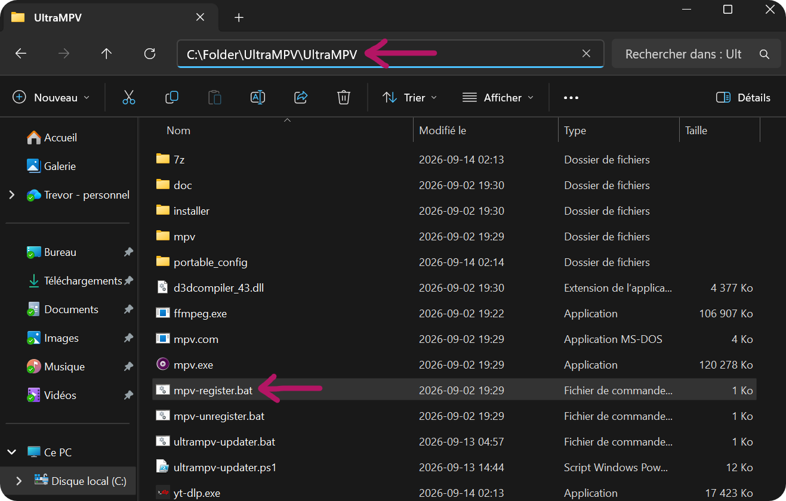
  <span>➡️</span>
  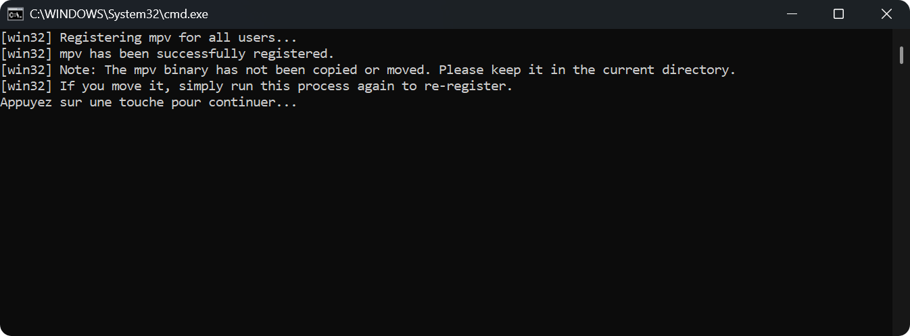
</div>

### 5. Locate and right-click the `mpv-register.bat` file then run as administrator so that Windows adds MPV Player to the context menu when you're playing media files on your computer. 

> ⚠️ **NOTE:** You must re-run `mpv-register.bat` as administrator whenever you move or rename your `UltraMPV` folder. Because UltraMPV operates as a localized, portable suite, Windows cannot automatically track its location like a traditional program utilizing a standard installer.

<br />

<div style="display: flex; align-items: center; justify-content: center;">
  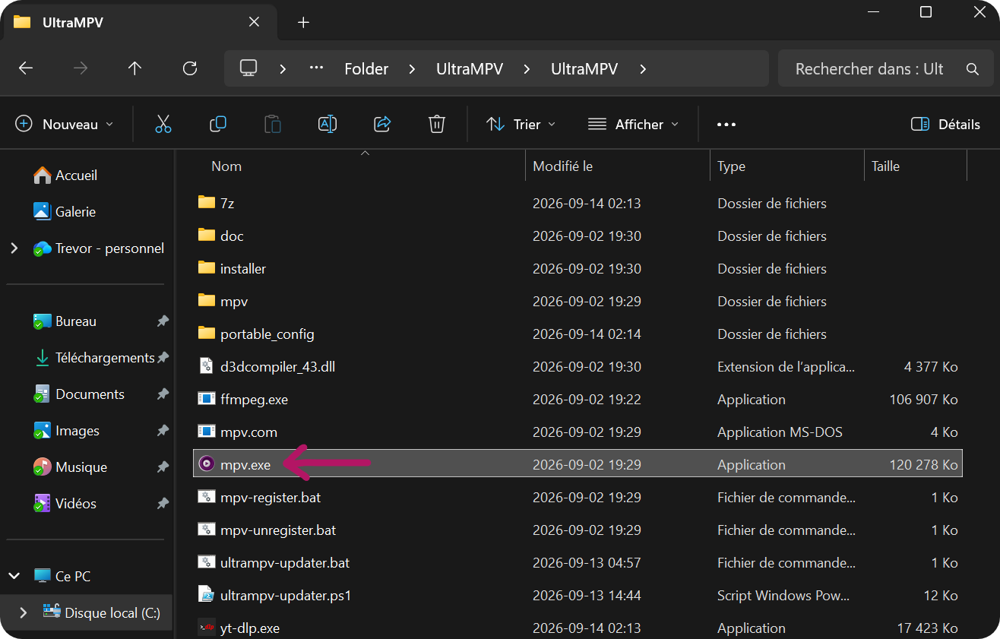
  <span>➡️</span>
  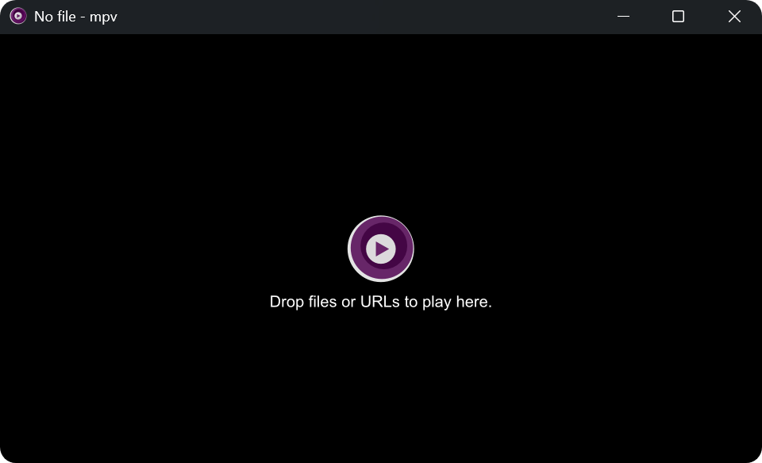
</div>

### 6. Double-click `mpv.exe` to open the MPV player. The player should open and stay open with a black screen. This indicates you have installed the proper build of MPV Player for your system.

<br />

<div style="display: flex; align-items: center; justify-content: center;">
  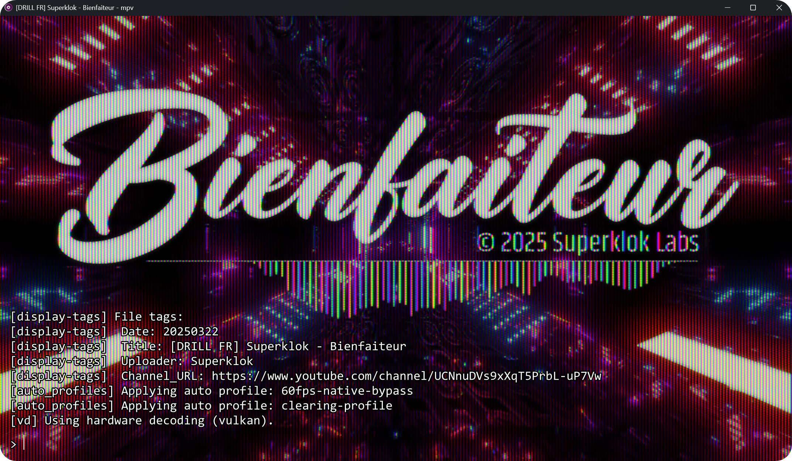
</div>

### 7. Open a video file with MPV Player by double-clicking the video, dragging the file on top of an opened MPV Player window, or by using the `mpv` command in the terminal along with the video URL (for example, `mpv "https://www.youtube.com/watch?v=6cG6HLHDzhI"`). Once the video is playing, press the backtick key (`` ` ``) to open the MPV Player terminal log, then make sure there are no red or yellow errors during playback.

<br />
<br />

## DONE!

<br />
<br />

## 🖥️ Command-Line Usage Setup Guide (Optional)

### Because UltraMPV operates as a fully sandboxed, portable suite, it does not invasively modify your Windows system environment variables or `PATH` out of the box. 

<br />

### If you wish to execute UltraMPV from any terminal window globally:

<br />

<div style="display: flex; align-items: center; justify-content: left;">
  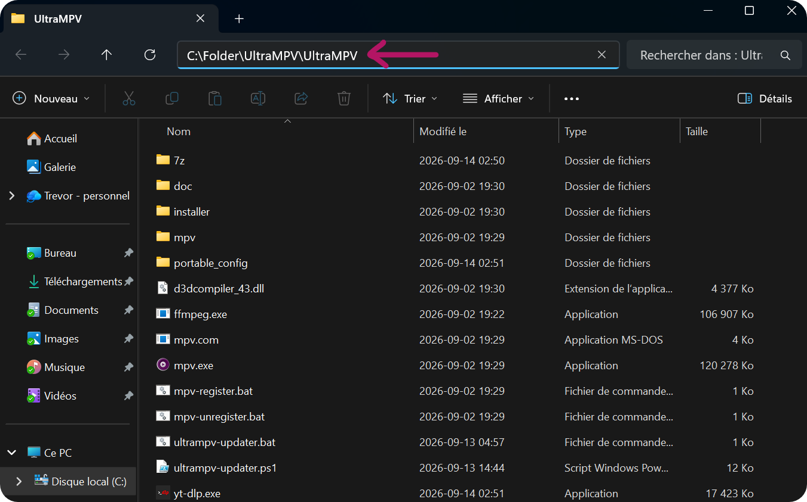
</div>

### 1. Copy the absolute path to your `UltraMPV/` root folder where mpv.exe resides (for example, `C:\Folder\UltraMPV\UltraMPV`).

<br />

<div style="display: flex; align-items: center; justify-content: left;">
  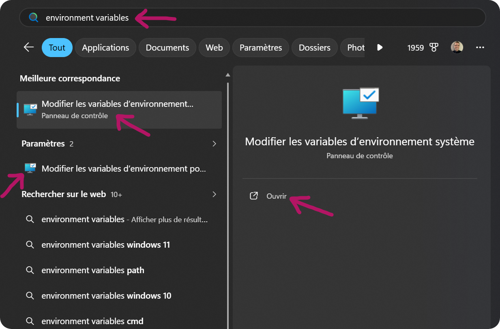
</div>

### 2. Press the `Windows Key`, type `environment variables`, and press `Enter`.

<br />

<div style="display: flex; align-items: center; justify-content: left;">
  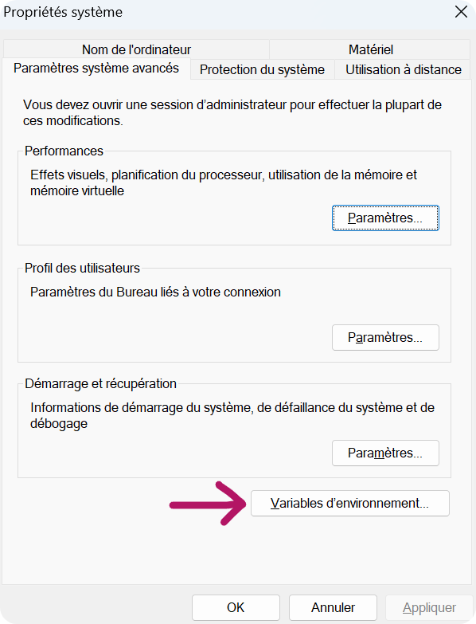
</div>

### 3. Click `Environment Variables...` at the bottom right.

<br />

<div style="display: flex; align-items: center; justify-content: left;">
  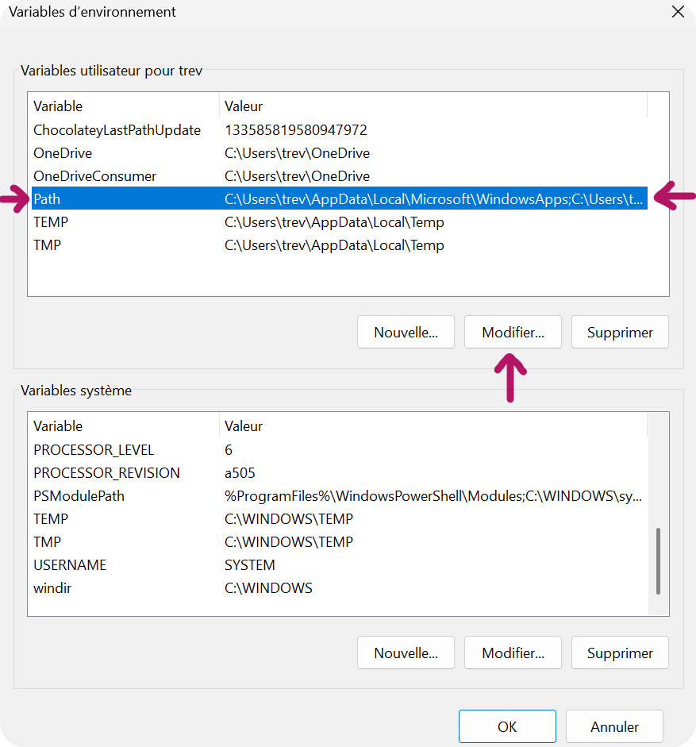
</div>

### 4. Under `User variables` (top box), select `Path` and click `Edit...`.

<br />

<div style="display: flex; align-items: center; justify-content: center;">
  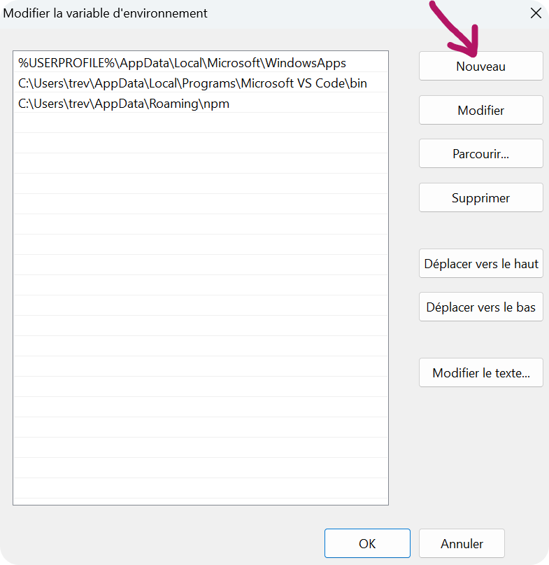
  <span>➡️</span>
  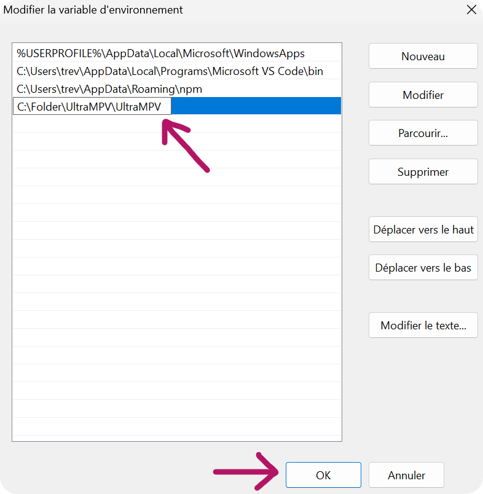
</div>

### 5. Click `New`, paste your UltraMPV folder path, and click `OK` to save.

<br />

<div style="display: flex; align-items: center; justify-content: center;">
  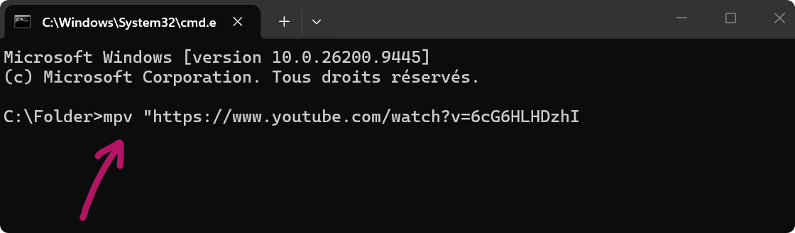
  <span>➡️</span>
  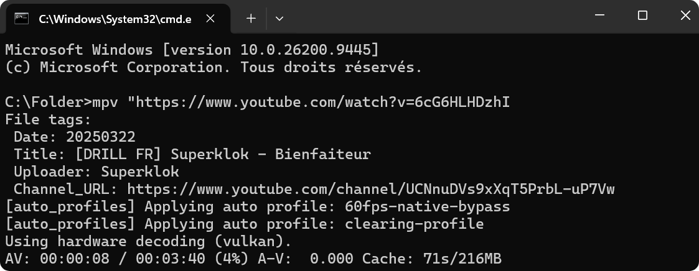
</div>

### You can now open a fresh terminal anywhere on your computer and type `mpv "https://www.youtube.com/watch?v=6cG6HLHDzhI"` or `mpv video.mp4` to stream or play local files instantly!

<br />
<br />

# 📺 UltraMPV Configuration Summary

### Designed explicitly for the Windows and NVIDIA ecosystem, UltraMPV is effectively the WORLD'S BEST configuration for rendering real human video content on fixed 4K 60Hz displays. By engineering a sophisticated synergy between low-level internal performance parameters and high-fidelity external shaders, this project establishes the absolute gold standard for realistic, true-to-life 4K playback.

<br />

### Unlike static high-quality templates that drain your system resources, UltraMPV features Dynamic Profile Logic that adapts to your media in real time. It intelligently deploys advanced Chroma reconstruction via `CfL_Prediction` to mathematically recover lost color detail in sub-4K content. The moment you play native 4K video, the engine instantly flushes unnecessary upscaling shaders—preventing wasted GPU overhead and ensuring frame-perfect, zero-compromise playback.

<br />

## 📜 Feature List

* ### <ins>Full Out-of-the-Box Portability:</ins> 
  UltraMPV is 100% self-contained and fully portable! Configuration trees, shaders, scripts, screenshots, and video clips all live neatly within the application folder rather than littering your system's `%APPDATA%` directory.

* ### <ins>Lossless Video Clipping Engine (`r` Key):</ins> 
  Cut high-fidelity segments from your local videos instantly at native resolution using a lightning-fast background FFmpeg stream copier. No re-encoding, zero performance lag, and pixel-perfect results saved directly into `portable_config/clips/`.

* ### <ins>Streamlined Automated Core Updater:</ins> 
  The `ultrampv-updater.bat` installer has completely redesigned the UltraMPV installation process so that it automatically structures your folder trees and updates your core player binaries, decoders, and yt-dlp scrapers in the background without overwriting your custom configuration tweaks or user data.

* ### <ins>Cascade Processing Architecture:</ins> 
  Utilizes an efficient, pre-appended cascade design (`glsl-shaders`) that initializes core shader blocks on startup rather than forcing resource-heavy compilation steps mid-stream. Lower-resolution pipelines step down seamlessly via explicit cache resets (`glsl-shaders-clr`) only when entering 4K spaces, completely neutralizing thread stalls and window freezing when transitioning between video sizes.

* ### <ins>Ghosting-Free Motion Cadence:</ins> 
  The synchronized pairing of `video-sync=display-resample` and `tscale=oversample` provides precise frame-step matching. By matching frame delivery to display timings without using artificial frame-blending or temporal interpolation filters, this pipeline preserves 100% texture and skin-pore sharpness during fast panning shots while completely eliminating 24p judder on fixed 60Hz panels.

* ### <ins>`SSimSuperRes` Structural Super-Resolution:</ins> 
  Bypasses artwork-trained, edge-doubling neural models (like FSRCNNX or NNEDI3) which cause an artificial "oil painting" or plastic look on human subjects. Instead, `SSimSuperRes.glsl` works via downscaling feedback loops, continually comparing the scaled frame against the source data to preserve authentic textural realism, skin pores, fine wrinkles, and background film grain on sub-4K masters.

* ### <ins>Codec-Aware Bitrate Debanding:</ins> 
  A reactive anti-banding system segments files by inspecting raw bit-budgets per compression standard (H264 >= 15M, HEVC >= 8M, AV1 >= 6M, VP9 >= 8M). It forces a non-destructive reference pass (`iterations=1`) on high-fidelity files to protect original grain maps, but automatically engages an aggressive pass (`iterations=3`, `threshold=45`) when compressed, low-bitrate streams are detected.

* ### <ins>Spatial Error-Diffusion Dithering:</ins> 
  Replaces basic, patterned ordered dithering arrays with advanced spatial distribution algorithms (`dither=error-diffusion`). This math engine pushes rounding errors to neighboring pixels in a fluid, non-repeating pattern, completely eliminating macro-gradients and color banding across uniform areas like smooth skin tones and uniform backgrounds.

* ### <ins>Unified Vulkan Zero-Copy Rendering:</ins> 
  Migrates the playback pipeline natively to high-performance Vulkan (`gpu-api=vulkan` and `gpu-context=winvk`). This anchors rendering directly inside the Windows graphics swapchain, providing low-overhead decoding, stable frame rendering, and clean presentation timing on massive 4K UHD masters.

* ### <ins>`CfL_Prediction` Chroma Reconstruction:</ins> 
  Deploys a high-accuracy, luma-guided prediction model (`CfL_Prediction.glsl`) that uses the video's high-resolution brightness channel to reconstruct missing color information. Mapping color boundaries directly to luminance detail eliminates color bleeding and tightens color accuracy around eyes, lips, and fast-moving human silhouettes.

* ### <ins>`SSimDownscaler` Perceptual Reduction:</ins> 
  Employs structure-similarity models (`SSimDownscaler.glsl`) to downscale 4K assets onto lower-resolution displays (like 1440p or 1080p monitors). The algorithm preserves localized contrast and fine specular highlights, rendering a downscaled image that holds true to the master file.

* ### <ins>Purist Adaptive Edge Sharpening:</ins> 
  Integrates a high-precision `adaptive-sharpen.glsl` pass inside the native 4K and downscaling loops to counteract physical display anti-aliasing and lens softening. By analyzing localized spatial contrast, it sharpens fine details—like hair strands and pores—without introducing edge halos or boosting image noise.

* ### <ins>Native 60fps Performance Bypass:</ins> 
  Tracks incoming media framerates dynamically. It instantly shuts down the oversample engine (`interpolation=no`) when native 60fps media is opened, preventing processing artifacts and keeping system overhead low on sports, gameplay, or high-framerate action content.

* ### <ins>Silicon-Level H.264 Driver Failsafe:</ins> 
  Dynamically intercepts H.264 video streams on initialization and routes them away from broken NVIDIA Vulkan driver pathways, safely executing them via native hardware CUDA channels (`hwdec=nvdec`). This completely prevents unwatchable macroblock corruption while maintaining hardware processing stability.

<br />
<br />

## 🛠️ Custom Controls & Navigation

UltraMPV features an optimized, high-precision keyboard binding matrix (`input.conf`) specifically designed for frame-accurate tracking and analysis of high-motion 4K 60fps real human video footage and live streams.

### ⏱️ Micro-Seeking (Precision Navigation)
Standard media players rely on "fuzzy" 5-to-10 second seeking loops that drop you onto variable keyframes. UltraMPV enforces hardware-level exact millisecond alignment.
* **`→` (Right Arrow):** Advances the video by exactly **1 second**.
* **`←` (Left Arrow):** Reverses the video by exactly **1 second**.

### ⏩ Standard Seeking Fallbacks
When you need to cross larger timeline distances quickly without losing precision, use the modifier layer.
* **`Shift + →`:** Advances the video by exactly **5 seconds**.
* **`Shift + ←`:** Reverses the video by exactly **5 seconds**.

### 🎞️ Frame-Perfect Analysis
For deep analysis of movement, capturing microexpressions, selecting the perfect video thumbnail, or observing fast-action changes, step through individual video frames with zero performance stutter.
* **`↑` (Up Arrow):** Advances the video forward by exactly **1 frame**.
* **`↓` (Down Arrow):** Steps the video backward by exactly **1 frame**.

### 🎬 Lossless Video Clipping
A simple, zero-lag hotkey toggle that handles high-fidelity local file video clip creation, saving directly to your `portable_config/clips/` folder.
* **`r` Key:** Toggles local file clip recording **on/off**.

<br />
<br />

## ⚠️ PLEASE NOTE! ⚠️

### Hardware Optimization & Performance Metrics:
This configuration is specifically engineered for high-performance setups utilizing desktop NVIDIA graphics hardware (such as the RTX 5070 Ti). Combining `SSimSuperRes.glsl` and `CfL_Prediction.glsl` via a continuous Vulkan cascade pipeline, alongside `adaptive-sharpen.glsl` in 4K spaces, places a heavy workload on the GPU compute planes. 

To audit your real-time performance, press `Shift + I` during playback, then hit `2` to view your **Frame Timings**. To ensure smooth, stutter-free playback, your "Estimated" and "Measured" compute times must remain safely below your monitor's physical refresh interval (for example, `< 16.6ms` for a 60Hz panel or `< 6.9ms` for a 144Hz panel). If you experience dropped frames, ensure your graphics card is not entering into a power-saving throttling mode.

### Automated Spatial Dithering Handshake:
This setup relies on reference-grade spatial distribution mapping (`dither=error-diffusion`). By default, the configuration uses `dither-depth=auto`, which instructs `mpv` to dynamically query the active Windows DXGI graphics swapchain on the fly. The engine will automatically deploy a 10-bit or 8-bit error-diffusion shader pattern to match the physical capabilities of your active monitor. 

If you choose to hardcode this setting (e.g., `dither-depth=10`), you **must** verify that your Windows Display Settings or NVIDIA Control Panel is actively transmitting a true 10-bit color container signal to that monitor. Forcing a 10-bit rendering pipeline into a monitor running an active 8-bit connection will create color banding and micro-gradients across uniform human skin tones.

### NVIDIA Full Dynamic Range Configuration:
Open your **NVIDIA Control Panel** and navigate to *Change Resolution*. Scroll down and guarantee that your **Output Dynamic Range** is explicitly toggled to **Full (0-255)** rather than *Limited (16-235)*. Leaving this driver setting on Limited forces the GPU to compress video data packets, crushing deep shadow detail and clipping specular highlights, which will make your advanced configuration look flat and washed out.

### Display Context Toggling & SDR Tone-Mapping:
This profile is highly optimized out of the box to pass raw high-dynamic-range metadata directly to the modern Windows DXGI HDR swapchain using `target-colorspace-hint=yes`. 

However, if you are viewing HDR content on a standard dynamic range display (SDR monitor), you should open `mpv.conf` and manually uncomment the target peak variable in your main configuration block by removing the leading hash mark so that it reads `target-peak=300`. For absolute reference accuracy, adjust that numerical value to match the exact, measured peak luminance nits specification of your specific panel model.

### Required Shaders Folder Layout:
For this build to initialize without fatal errors, you must download the necessary assets and place them directly in the root of your local configuration directory. Do not use nested subfolders. Ensure your directory structure is organized precisely as follows:

```text
📁 UltraMPV/                   (Main Application Root Folder)
  ├── 📄 mpv.exe               (Automatically Deployed Via Updater)
  ├── 📄 ffmpeg.exe            (Automatically Deployed Via Updater)
  ├── 📄 yt-dlp.exe            (Automatically Deployed Via Updater)
  ├── 📄 mpv-register.bat      (Automatically Deployed Via Updater)
  ├── 📄 mpv-unregister.bat    (Automatically Deployed Via Updater)
  ├── 📄 ultrampv-updater.bat  (UltraMPV Core Updater Executable Wrapper)
  ├── 📄 ultrampv-updater.ps1  (UltraMPV Background Automated API Script Engine)
  └── 📁 portable_config/      (Enables Self-Contained Portable Mode)
        ├── 📄 mpv.conf        (UltraMPV Configuration & Auto-Profiles)
        ├── 📄 input.conf      (UltraMPV Custom keybindings)
        ├── 📁 screenshots/    (Auto-Generated Pixel-Perfect PNG Renders)
        ├── 📁 clips/          (Auto-Generated Lossless MP4 Video Clips)
        ├── 📁 scripts/
        │     └── 📄 clip.lua  (UltraMPV Clipping Script)
        └── 📁 shaders/        (Advanced GLSL Real-Time Upscaling Shaders)
              ├── 📄 CfL_Prediction.glsl
              ├── 📄 SSimSuperRes.glsl
              ├── 📄 SSimDownscaler.glsl
              └── 📄 adaptive-sharpen.glsl
```

<br />
<br />

# 🍿 You're all set!

<br />
<br />

## ⚖️ License

### This project is licensed under the [MIT License](LICENSE). Third-party shaders and bundled binaries are subject to their own respective upstream licenses, detailed in the [THIRD-PARTY-LICENSES](THIRD-PARTY-LICENSES.md) file.

<br />

## 📼 Third-Party Shaders & Utilities Download Links

*   **SSimSuperRes Shaders:** https://gist.github.com/igv/2364ffa6e81540f29cb7ab4c9bc05b6b
*   **CfL_Prediction Shaders:** https://github.com/Artoriuz/glsl-chroma-from-luma-prediction/blob/main/CfL_Prediction.glsl
*   **adaptive-sharpen Shaders:** https://github.com/libretro/glsl-shaders/blob/master/sharpen/shaders/adaptive-sharpen.glsl
*   **SSimDownscaler Shaders:** https://gist.github.com/igv/36508af3ffc84410fe39761d6969be10
*   **MPV Player:** https://github.com/shinchiro/mpv-winbuild-cmake/releases/latest

<br />

---

💡 *If you find this project useful, reach out via [Upwork](https://www.upwork.com/freelancers/~01a2b86360ffeb733e)/[Contra](https://contra.com/Superklok) to hire Superklok Labs today!*